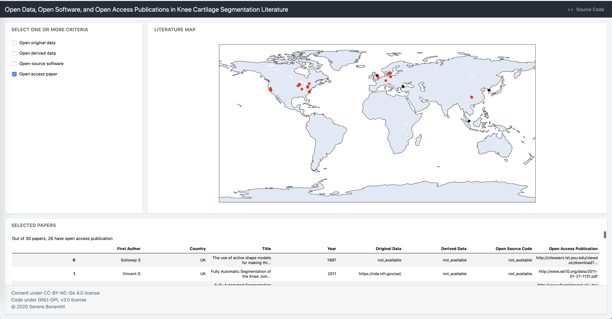

# John Hunter - Excellence in Plotting Context 2020  

See below the abstract for info on how to run it

 


Open science and reproducible research are fundamental to assess the value of scientific claim, compare new methods to existing ones, and collaborate to improve and expand robust scientific workflows to accelerate scientific discoveries, among others (Sandve et al. 2013, Rule et al. 2018). Some of the main characteristics that make a study open and reproducible are openness of original data and derived data (i.e. data created from a computation), open-source code, and open access publication. When data, code, and publication are available, papers transition from being advertisement of scientific work towards representing the actual scholarship (Donoho et al. 2009). 
 
This dashboard is meant to visualize openness and, potentially, reproducibility, of the papers published in a scientific domain. It is composed of three parts: 
-	A sidebar, where to select one or more criteria for literature exploration;
-	A map, where papers are represented as dots. Red dots correspond to papers matching the selected criteria, while black dots represent the remaining papers;
-	An output panel, which shows the number of papers matching the criteria and the corresponding paper data.
The dashboard is created in Jupyter notebook, using numpy and pandas to analyze the data, plotly to create the map, and Jupyter-flex and voila to create the dashboard. 

The data used for this example are about the literature on knee cartilage segmentation, updated to February 2019, and published in the paper (Bonaretti et al., 2020). In this case, out of 30 studies, 20 used open original data but only 2 shared derived data, only 3 released open software, but 26 papers are openly accessible. This shows how the field is at the beginning of the transition to open and reproducible research.

This dashboard can potentially be extended and used by other communities, using the template .csv file provided in the github repository for the literature research. 

DOI of references:  
- Sandve et al. 2013: https://doi.org/10.1371/journal.pcbi.1003285  
- Rule et al. 2018: https://doi.org/10.1371/journal.pcbi.1007007  
- Donoho et al. 2009: https://doi.org/10.1109/MCSE.2009.15  
- Bonaretti et al. 2020: https://doi.org/10.1371/journal.pone.0226501  

## Dashboard live
Click the button below to start a binder session:  
[](https://mybinder.org/v2/gh/sbonaretti/Hunter_viz_2020/master?filepath=open_literature_flex.ipynb)

Once started:
- Go to `Cell`->`Run all`
- Click on the `Voilà` button.
Give it a few seconds, and have fun!

## Run the dashboard locally 
In terminal:
- Install voilà and jupyter-flex:  
  ```
  pip install voila
  pip install jupyter-flex
  ```
- Create the dashboard:
  ```
  voila --template=flex open_literature_flex.ipynb 
  ```
Note: If using JupyterLab, might need to restart
  
## How to reuse the code for your own dataset
- Fill out `data_template.csv` with your own data. Information about the data fields are in the file itself  
- In `open_literature_flex.ipynb`, under `Load the data`:
  - Change file name to your own `.csv` file name  
  - Comment out `zenodo_url = "https://zenodo.org/record/3872040/files/"`
  - Comment out `wget.download(zenodo_url + file_name, "./" + file_name) # input, output`
- Make sure your `.csv` file is in the same folder as your notebook


